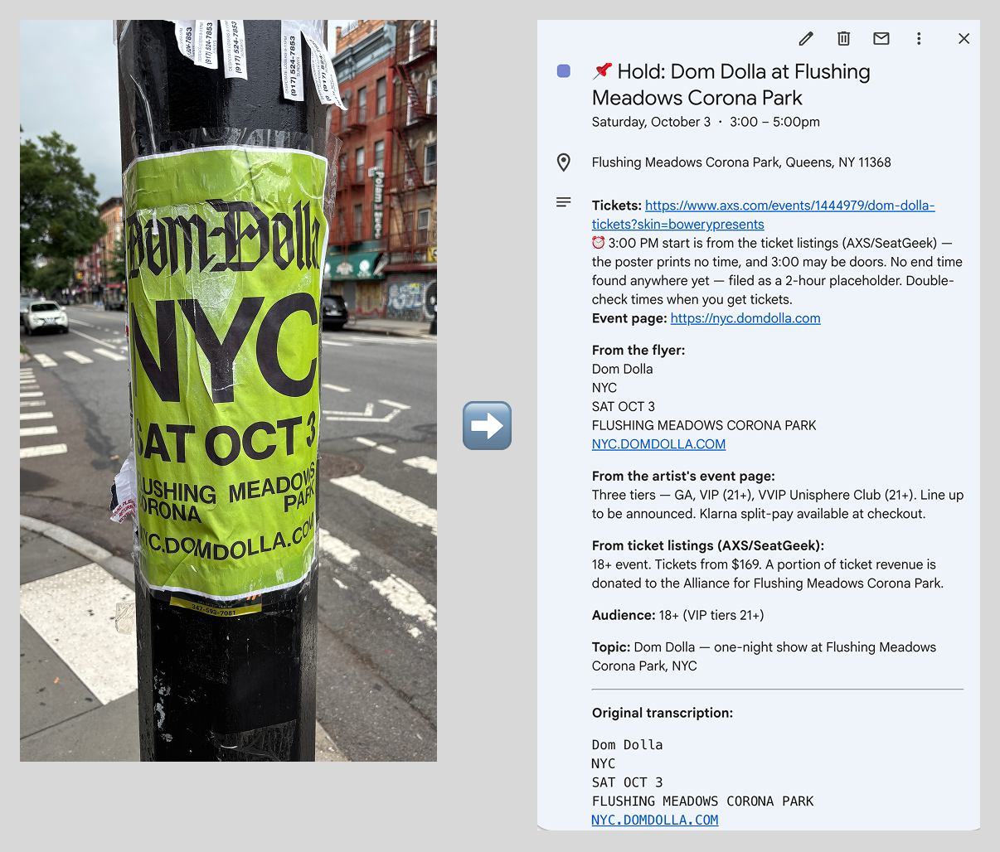
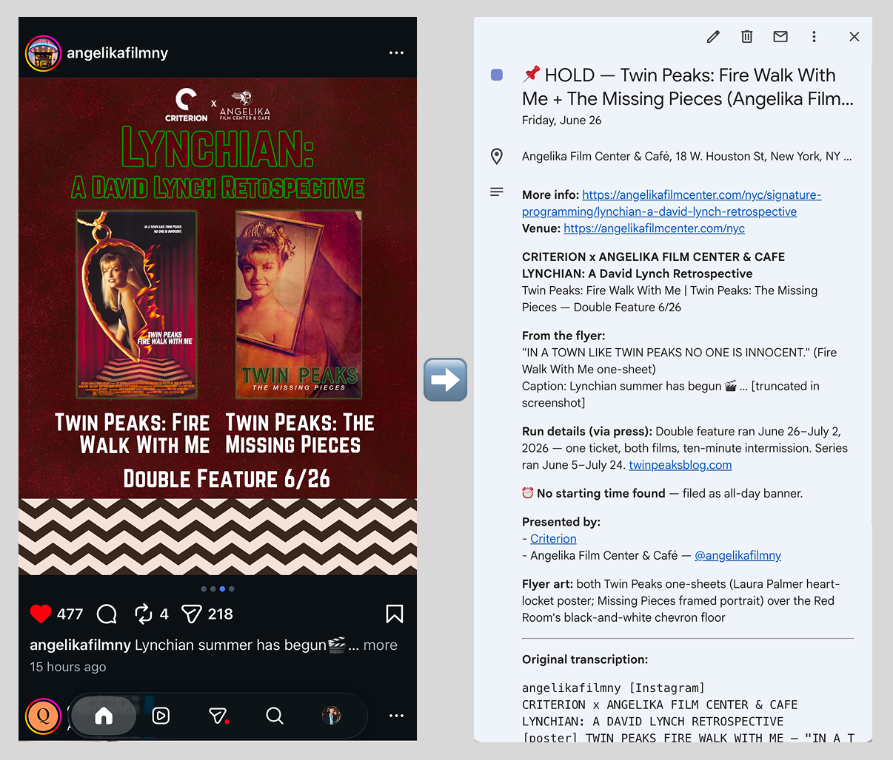

# pic-to-cal

A [Claude skill](https://docs.claude.com/en/docs/agents-and-tools/agent-skills) that turns a picture of an event into a calendar hold. Attach a screenshot, flyer, poster, or a photo of a poster on the street, say "calendar this" (or any trigger phrase in [SKILL.md](SKILL.md)), and a 📌 Hold lands on your Google Calendar with everything needed to actually attend — the event's own link on top, venue address, and the full flyer context with live links. If the event sells tickets, that top link is where to buy them, and if the event page showed a sold-out notice when the hold was filed, the hold says so, dated the day it was checked.

*A poster on a lamppost becomes a hold with the tickets link on top — plus a caveat that 3:00 may be doors, because the poster printed no time and the ticket listings did.*

The part that makes it more than OCR: before filing, the skill finds the event's real page on the web. That's what makes the hold complete — the live link and street address are already in it if you decide to go — and it doubles as a fact-check, with the page winning over the image on any conflict.

## How it works

1. Transcribe everything in the image and confirm it's an event.
2. Extract structured fields: title, date, time, venue, links, live speakers.
3. Find a source page — printed URLs and social handles in the image are checked first; web search is the fallback.
4. Verify the image's facts against the page. Every filing lands in one of three honest states: **✓ Verified**, **⚠ Unverified** (a link exists but couldn't confirm the facts), or no page found. The state is labeled in the event body, per field where it matters.
5. Show one confirm block (yes / no / fix), then file the hold — to a calendar named "Event Holds" if one exists on your account, otherwise to your main calendar.

Some of the rules the spec encodes, each earned by a real test case: a timezone printed on the flyer beats one derived from the venue; a "midnight" event starts at 23:59 on the day the flyer names, so it never jumps to the next day on the calendar; a date with no findable time files as an all-day banner and says so; people are listed as speakers only if they appear live at the event, so a film's cast never shows up as event speakers.

*The all-day rule in action: an Instagram post with no start time anywhere — on the post or the web — files as an all-day banner and says exactly why.*

## Install

Copy or symlink this folder into `~/.claude/skills/`. You'll need Claude with web search and a Google Calendar connector available.

It works out of the box — holds file to your main calendar. To keep holds separate, create a Google calendar named **"Event Holds"** (case doesn't matter) and the skill files there from then on: every hold can be shown or hidden with one click in the sidebar, and none of them touch your main calendar.

## Evolution

[CHANGELOG.md](CHANGELOG.md) tracks every version; releases are tagged. The spec is hardened by a loop of real screenshot tests: file a hold, inspect it on the calendar, fold what was wrong back into the spec as a rule.

A note on history: the v0.1.0 and v0.2.0 commits were reconstructed on 2026-07-04 from the files as they stood on those earlier dates. Their commit messages say so.

## Status

A personal tool under active testing, and the working spec for a planned iOS share-intent app that does the same job without opening a chat.
